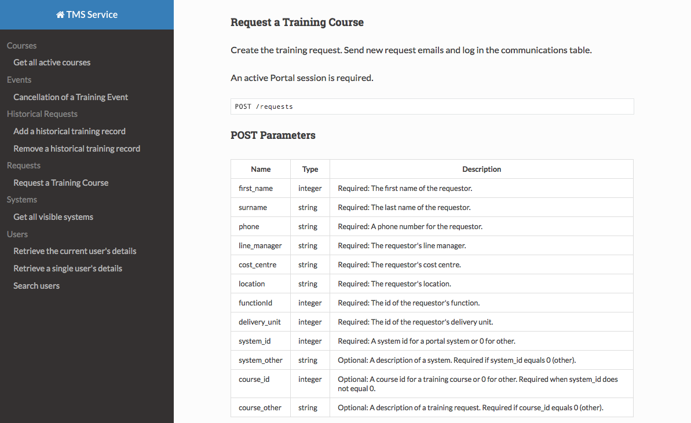

# Read The Docs template for Couscous with Menu Sections and Piped Tables

This project builds upon [CouscousPHP Template-ReadTheDocs](https://github.com/CouscousPHP/Template-ReadTheDocs).

## Differences

The menu must contain sections within your `couscous.yml`:

```yaml
# The left menu bar
menu:
    sections:
        courses:
            text: Courses
            items:
                oldCourses:
                    text: Old Courses
                    relativeUrl: old-courses.html
                newCourses:
                    text: New Courses
                    relativeUrl: new-courses.html
        historicalRequests:
            text: Historical Requests
            items:
                addHistory:
                    text: Add a historical record
                    # You can use relative urls
                    relativeUrl: doc/faq.html
                removeHistory:
                    text: Remove a historical record
                    # Or absolute urls
                    absoluteUrl: https://example.com
```

## Additions

Styling for piped tables:

```
| Name     | Type    | Description                                                                     |
| ----     | ----    | -----------                                                                     |
| q        | array   | The search terms.                                                               |
| sort     | string  | The sort field. You can use firstName, lastName and/or email. Default: lastName |
| page     | integer | The page number. Default: 1                                                     |
| per_page | integer | The number of items per page. Can be 10, 25, 50 or 100. Default: 10             |
```


